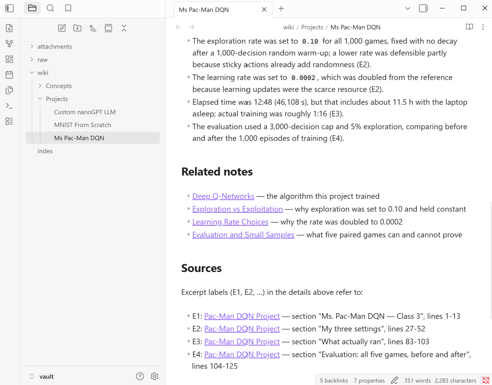
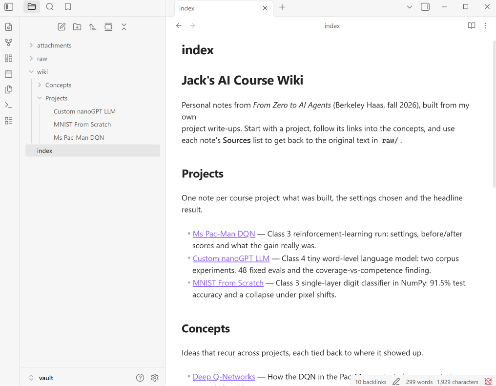
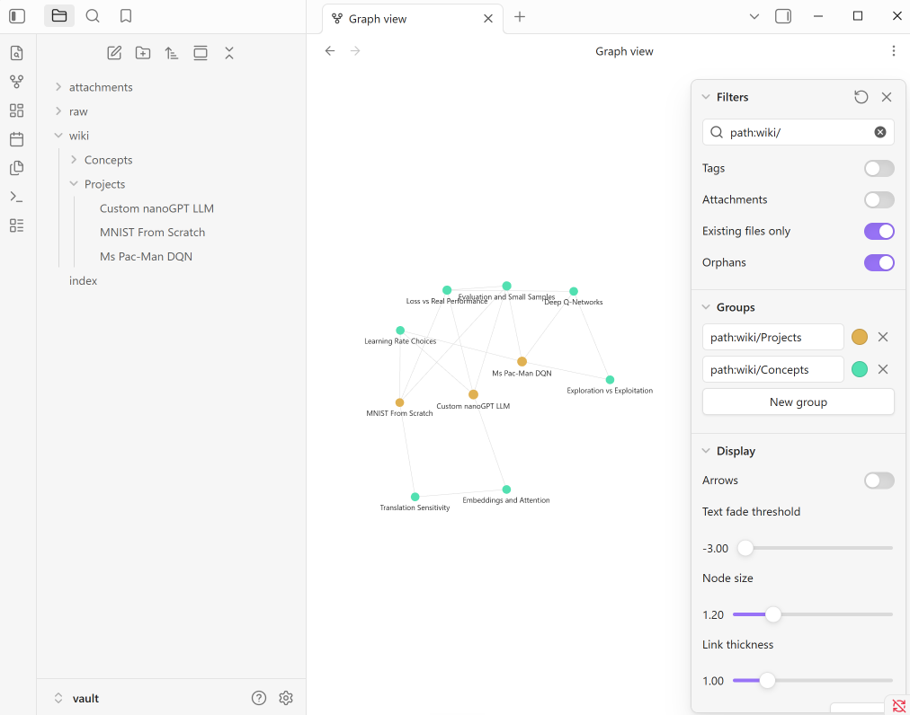
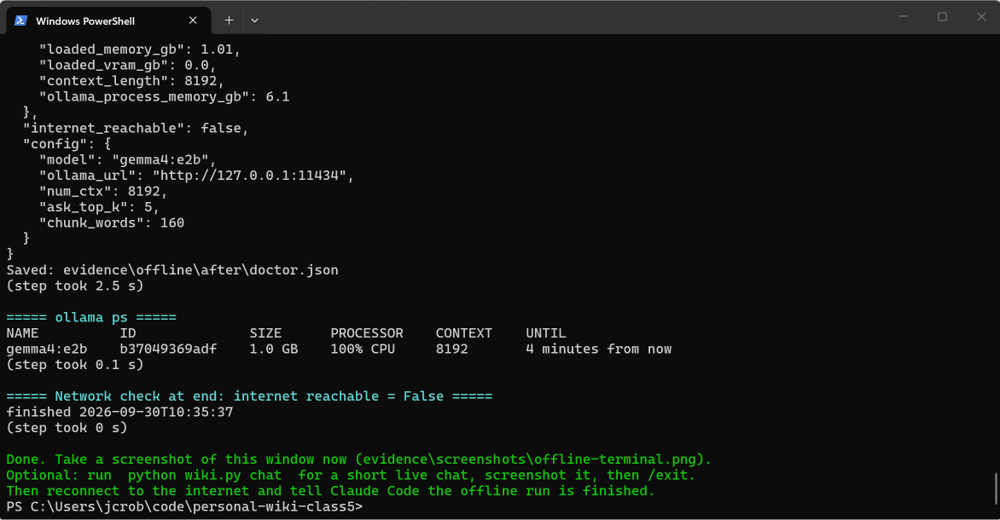

# Personal Wiki CLI — local Gemma + RAG (Class 5, Assignment 4)

A terminal assistant over my own notes from *From Zero to AI Agents*. My three earlier project
write-ups are the sources. A local Gemma model turns them into a linked Obsidian wiki. My own
Python harness gives three modes on top: **chat** with a study-partner persona, **ask** for
cited factual answers, and **search** for the original passages. Everything runs on my laptop
with the internet off.

**Result in one line:** Of the three answerable questions, two were answered correctly with correct
citations. The two-source question (T3) was half right: Pac-Man's 0.0002 was correct, but it
misread the LLM's learning rate. The unsupported question was refused with INSUFFICIENT
EVIDENCE. All four ran offline on `gemma4:e2b` (CPU only).

| Jump to | |
|---|---|
| CLI and harness code | [`wiki.py`](wiki.py), [`harness/`](harness) |
| Wiki (open `vault/` in Obsidian) | [`vault/index.md`](vault/index.md), [`vault/wiki/`](vault/wiki), [`vault/raw/`](vault/raw) |
| Four ask-mode evidence cards | [T1](evidence/offline/T1.md) · [T2](evidence/offline/T2.md) · [T3](evidence/offline/T3.md) · [T4](evidence/offline/T4.md) |
| Chat / search mode checks | [`evidence/offline/mode-checks.md`](evidence/offline/mode-checks.md) |
| Offline run transcript | [`evidence/offline/terminal-transcript.txt`](evidence/offline/terminal-transcript.txt) |
| Screenshots | [`evidence/screenshots/`](evidence/screenshots) |

---

## 1. Purpose and sources

The wiki exists to answer questions about my own coursework: what I trained, which settings I
chose and why, what the results were, and which ideas carried across projects. It is scoped to
three sources I wrote myself, so every answer can be checked by hand.

| Source id | Original (unchanged, in `vault/raw/`) | What it is |
|---|---|---|
| `pacman-dqn` | [`Pac-Man DQN Project.md`](vault/raw/Pac-Man%20DQN%20Project.md) | README of my Class 3 Ms. Pac-Man DQN repo ([pacman-dqn-class3](https://github.com/jcrobbo1007/pacman-dqn-class3)) |
| `custom-llm` | [`Custom LLM Project.md`](vault/raw/Custom%20LLM%20Project.md) | README of my Class 4 nanoGPT repo ([custom-llm-class4](https://github.com/jcrobbo1007/custom-llm-class4)) |
| `mnist` | [`MNIST From Scratch Log.md`](vault/raw/MNIST%20From%20Scratch%20Log.md) | My Class 3 MNIST-from-scratch run log |

The originals are byte-for-byte copies. [`data/source_catalog.json`](data/source_catalog.json)
records each one's id, path and SHA-256, so any change to them would be visible. The originals
still contain image links that pointed into their own repos; those images are not copied here,
so Obsidian shows them as missing. The text is untouched on purpose.

**How originals become wiki pages.** [`data/wiki_plan.json`](data/wiki_plan.json) maps sources
to ten readable notes in two folders, `Projects/` and `Concepts/`. For each note, ingestion
pulls the listed sections out of the originals and sends them with
[`prompts/ingest-instructions.md`](prompts/ingest-instructions.md) to local Gemma. Gemma writes
the Summary and Key details. The harness adds the title, front matter, related-note links and
the Sources list. Because the harness writes the links and filenames, not the model, they always
point at real notes.

## 2. Setup and device

**Device** (from [`evidence/offline/doctor.json`](evidence/offline/doctor.json)):

| | |
|---|---|
| OS | Windows 11 (10.0.26200), x64 |
| CPU | Intel Core Ultra 7 258V, 8 threads |
| RAM | 33.9 GB total; 8.4 GB available at the start of the offline run, 4.8 GB with the model loaded at the end |
| GPU / VRAM | Intel Arc 140V (integrated, shares system RAM). Not used: Ollama reports `100% CPU` and 0.0 GB VRAM |
| Free disk | 532.9 GB |
| Python | 3.13.14 (standard library only, no pip packages) |

**Model and runtime:**

| | |
|---|---|
| Model | `gemma4:e2b` (Gemma 4 E2B), digest `b37049369adfe3d2b653af0ab301a062ca5cbe96ace6aa0d3f2559ee9b563fc2` |
| Quantization | Q4_K_M (4.59 GB file, including the vision projector) |
| Runtime | Ollama 0.35.0, local HTTP API at `127.0.0.1:11434` |
| Official download | `ollama pull gemma4:e2b` ([ollama.com/library/gemma4:e2b](https://ollama.com/library/gemma4:e2b)). Weights are not committed. |
| Context | `num_ctx` 8192; temperature 0.0 for ask, 0.6 for chat, 0.2 for ingest |

**Why E2B.** This laptop runs the model on the CPU; the integrated Arc GPU is not used. With E2B
loaded, the model runner held about 6 GB, and 4.8 GB of RAM was still free at the end of the
run. Each ask answer took 25–33 s. E4B would need more memory and answer more slowly on the same
CPU. The one wrong answer (T3) came from retrieval missing the key passage, not from the model
running out of ability, so a larger model would not obviously have fixed it.

**Measured** (from `evidence/offline/after/doctor.json`, `ask-tests-summary.json` and the ingest log):

| Measurement | Value |
|---|---|
| Model memory once loaded (Ollama `/api/ps`) | 1.01 GB (as reported; see note) |
| Ollama process memory (working set, server + `llama-server` runner) | 6.1 GB after all tests (5.96 GB right after T1–T4) |
| Full ingest of 3 sources to 10 notes | 338.8 s (17–51 s per note) |
| Ask answer, per question (T1–T4) | 33.0 / 27.7 / 28.6 / 25.2 s (about 1,600–2,100 prompt tokens, 20–30 output tokens/s) |
| Chat reply | 3–9 s for short conversational turns (C1, C2, C4); 18–19 s when notes are looked up (C3, C5) |

Note on memory: Ollama's `/api/ps` reports 1.01 GB for the loaded model, but the process that
actually runs it (`llama-server`) had a 6.1 GB working set. The larger figure is what the laptop
actually gives up. In the online rehearsal I found the harness only counted processes named
`ollama*`, which missed `llama-server`, and fixed that in
[`harness/system.py`](harness/system.py) before the offline run.

**Commands** (Windows PowerShell, from the repo root; on Mac/Linux use `python3 wiki.py` instead of `.\wiki`):

```powershell
# once, online: install Ollama, pull the model, run the harness self-test
powershell -ExecutionPolicy Bypass -File scripts\setup_windows.ps1

.\wiki --help
.\wiki ingest ./vault/raw                  # build catalog, index and wiki notes with local Gemma
.\wiki search "exploration rate"           # original passages only, no model call
.\wiki ask "What learning rate did I use for the MNIST model?" --mode local
.\wiki chat                                # Margin, the study partner; /exit to leave
.\wiki check                               # review aid for the generated notes

# the graded offline run (Wi-Fi off first)
powershell -ExecutionPolicy Bypass -File scripts\run_offline_evidence.ps1
```

Useful errors: if Ollama is not running, or the model has not been pulled, every model command
stops with a message naming the fix (`ollama serve` / `ollama pull gemma4:e2b`). There is no
cloud fallback. `search` still works with the model off.

## 3. Architecture

| Piece | What it is here | Code |
|---|---|---|
| **Model** | Gemma 4 E2B running in Ollama. It only sees the text the harness sends. It does not read files, remember sessions or call tools. | [`harness/llm.py`](harness/llm.py) |
| **Retrieval tool** | Splits the originals into passages by Markdown section (≈160-word windows, 40-word overlap, source path and line numbers kept) and ranks them with BM25 keyword scoring. No model, no network. | [`harness/retrieval.py`](harness/retrieval.py) |
| **RAG workflow** | Ask mode: retrieve → put the numbered passages and research rules into the prompt → Gemma answers → citations checked. | [`harness/modes.py`](harness/modes.py) `ask()` |
| **Harness** | Picks the mode, loads that mode's instructions, keeps chat history for chat only, decides when chat needs notes, builds prompts, calls Gemma, checks citations, handles errors and saves every result. | [`harness/`](harness) |
| **CLI** | The `wiki` command: `ingest`, `index`, `search`, `ask`, `chat`, `check`, `doctor`, `eval`, `modecheck`, `--help`. | [`wiki.py`](wiki.py) |

**One question traced through the code** (`.\wiki ask "What learning rate did I use for the MNIST model?"`):

1. `wiki.py` `main()` parses the command and calls `cmd_ask()`. Ask gets a fresh process with no chat state.
2. `retrieval.load_index()` loads the passages from `.index/chunks.json`. That file is rebuilt from `vault/raw/` at every ingest and kept outside the vault.
3. `modes.ask()` calls `Index.search()`. BM25 ranks passages, keeps the top 5 (at most 3 from any one file) and drops any below a score of 3.0. If nothing clears the bar, the harness answers `INSUFFICIENT EVIDENCE` itself, without calling the model.
4. The prompt is built from `prompts/wiki-instructions.md` (system) plus the passages labelled `[S1]…[S5]` with their paths, sections and line numbers, and then the question. No persona and no chat history go in.
5. `llm.OllamaClient.chat()` POSTs to `http://127.0.0.1:11434/api/chat` with temperature 0 and gets the answer plus token counts and timings.
6. `modes.check_citations()` confirms every `[S#]` exists and flags any number in the answer that is not in the cited passages. The result is `cited`, `cited-with-warnings`, `uncited` or `insufficient-evidence`.
7. `wiki.py` prints the answer, the citations with file and line numbers, and the check. `evidence.log_record()` appends the whole record to `evidence/logs/<date>.jsonl`.

**How the three modes differ:**

| | chat | ask | search |
|---|---|---|---|
| Instructions | [`prompts/persona.md`](prompts/persona.md): Margin, a warm, dry study partner who knows what it can and can't do | [`prompts/wiki-instructions.md`](prompts/wiki-instructions.md): neutral research rules | none |
| Conversation history | last 6 exchanges | never | never |
| Retrieval | only when the router says the turn needs notes, or on `/notes` | always | always |
| Model call | yes | yes (unless nothing is retrieved) | **no** |
| Citations | `[N#]` for facts taken from notes; ideas are labelled "Suggestion" | `[S#]` required on every factual sentence | shows paths and line numbers |

**When chat retrieves** (`ChatSession.route()`): conversational turns ("what can you help me
with?", "make that shorter", greetings, rewrite requests) never trigger a lookup. Other turns
run a search. Notes are used if the best passage scores ≥ 6.0, or if the message talks about
my own work (my project, run, score, model…) and the best score is at least 3.0. Chat history
stores my plain messages, not the injected passages, so notes from one turn don't pile up as
fake context in later turns. A claim I make in chat stays in chat history, and ask never sees
that history.

## 4. Design choices

- **Passage size.** Chunks follow Markdown sections, so a passage stays inside one topic, and
  run about 160 words with 40 words of overlap, so a table row and its explanation usually land
  together. Ask sends at most 5 passages (roughly 4,000–5,000 characters in T1–T4). That
  fits easily in the 8k context and leaves room for the answer.
- **Retrieval method.** Keyword BM25 with light stemming, so "moved" meets "Move". It needs no
  embedding model, so there is nothing extra to download and nothing that could quietly call a
  hosted API. The cost is weaker handling of paraphrase (see T2 and the reflection below).
  At most 3 passages come from any one file, so a question spanning two projects (T3) is not
  crowded out by the longer README.
- **Research rules vs. personality.** They live in separate files and are loaded by different
  code paths. Ask never gets the persona and chat never gets the research rules, so personality
  cannot leak into factual answers.
- **Insufficient evidence.** It is handled at two levels. The harness refuses before calling
  the model when nothing is retrieved, and the prompt tells Gemma to reply `INSUFFICIENT
  EVIDENCE:` when the passages don't answer the question.
- **Citation checks.** A citation isn't proof by itself, so the harness checks that labels exist
  and that numbers in the answer appear in the cited text. I still read every cited passage
  against the answer (the Assessment in each card).
- **Note names and folders.** Short subject names (`Ms Pac-Man DQN`, `Learning Rate
  Choices`…) with the first heading matching the filename. There are two topic folders,
  `Projects/` and `Concepts/`, and a grouped `index.md`. Machine ids (`note_id`, `source_ids`,
  model, date) live in front matter. Source hashes live in `data/source_catalog.json`.
  Retrieval chunks, logs and evidence stay outside `vault/`.
- **Re-ingestion without duplicates.** Filenames come from the plan, so re-ingesting overwrites
  the same file. `.\wiki ingest ./vault/raw --source mnist` regenerates only the notes built from
  that source. A note I have marked `reviewed: true` is never overwritten silently: the new draft
  goes to `.index/drafts/` instead, unless I pass `--force`. `wiki check` flags any note that is
  not in the plan.
- **Model settings.** Temperature 0 for ask gives repeatable, least-random answers. Gemma's
  thinking mode is switched off (`think: false`) so replies are direct and faster on CPU.
  No model or retrieval setting was changed after any result, so there is one offline run and
  no rerun. The online rehearsal ([`evidence/rehearsal/`](evidence/rehearsal), labelled online)
  found two harness measurement bugs, both fixed before the offline run and neither affecting
  answers. `check_citations()` read `[S4]` but not grouped citations like `[S4, S5]`, which
  produced false warnings; there is now a unit test for it. The process-memory figure also missed
  the `llama-server` runner.

## 5. The wiki in Obsidian

Open the `vault/` folder itself as the Obsidian vault. The graph is filtered with
`path:wiki/` and attachments are hidden (saved in `vault/.obsidian/graph.json`). Projects and
Concepts are colour-grouped.

1. **An open note with sources and related links:**
   
2. **The index, grouped by topic:**
   
3. **Graph view** (filter `path:wiki/`, attachments off):
   

**Traced path:** `index.md` → Ms Pac-Man DQN (under Projects) → its Related notes link to
Learning Rate Choices → Sources, E1 → `raw/Pac-Man DQN Project.md`, section "My three settings",
line 33, which contains "Doubled from the 0.0001 reference because the scarce resource was
learning updates".

**Review of generated notes.** `wiki check` flagged nothing: 0 issues in
[`evidence/offline/wiki-check.json`](evidence/offline/wiki-check.json). It only checks that each
number appears *somewhere* in the cited source, though, so reading every note against its
sections still found these errors, all fixed in `vault/wiki/`:

- **Evaluation and Small Samples:** "589.0 to 712.2" was presented as the Pac-Man score change.
  Those are decisions per game; the score went 492.0 → 876.0 (Pac-Man DQN Project.md lines 110–117).
  "The agent" scoring 16/16 was corrected to "the trained model", in both LLM experiments.
- **Exploration vs Exploitation:** said the proposed next experiment was ending episodes on life
  loss. The source says that is what I *would* want but did not propose; the proposal is replay
  capacity 5,000 → 25,000 (lines 269–288). Also corrected "the fixed rate is defensible because" to
  "the lower rate is defensible partly because" (line 31).
- **Ms Pac-Man DQN:** "training took 12:48" hid that about 11.5 h of that was the laptop asleep
  (actual training ≈ 1:16, line 91). The summary said evaluation "confirmed" the gain; the source
  says the direction is supported but the size is poorly estimated (lines 6–12).
- **Translation Sensitivity:** added the 5 px result (11.5%, chance 10%), fixed cause and effect
  (the blurry stencils are the diagnostic, not a result), and softened "convolutions are
  necessary" to the source's "the argument for convolutions" (MNIST log lines 44–57).
- **MNIST From Scratch:** the loss formula had an extra `)` (log line 14).
- **Embeddings and Attention:** "antonyms are grouped together" was corrected to the source's
  finding: every *antonym-slot* word shares one neighbourhood (`quiet` → `green` 0.692, `noisy`
  0.682, `hot` 0.678). "The model encoded a conclusion" was reworded; the conclusion is mine
  (Custom LLM Project.md lines 254–269).
- **Custom nanoGPT LLM:** matched 133 / 398 vocabulary types to exp 1 / exp 2 (line 87).
- **Learning Rate Choices:** the related-note label "0.0002 with Adam" (from `data/wiki_plan.json`,
  not Gemma) names an optimiser the Pac-Man source never states. It now says "doubled from the
  0.0001 reference" in the note and the plan.

The originals were never edited: `vault/raw/` is unchanged, and the SHA-256 hashes in
`data/source_catalog.json` still match. All 10 notes are marked `reviewed: true`, and
`wiki check` after the review is still clean
([`evidence/review/wiki-check.json`](evidence/review/wiki-check.json)).

**Duplicate check:** re-ingesting `mnist` offline left 10 notes before and 10 after, with
no new files (see the transcript, step "Duplicate check").

## 6. Evidence: four ask-mode tests (offline)

The questions and expected passages were written before the run, in
[`tests/questions.json`](tests/questions.json). That file sits outside the vault, so retrieval
can't find the answer key. Every card records the retrieved passages with paths and scores, the
exact model, the local execution setting, internet status, Gemma's verbatim answer, the checked
citations, and my assessment.

| Test | Question | Retrieved expected source? | Answer | Citations support it? | Card |
|---|---|---|---|---|---|
| T1 direct | Mean trained Pac-Man score vs. baseline | Yes, rank 1 (table) and 2 (headline) | 876.0 vs. 492.0 — **pass** | Yes, [S2] states both | [T1](evidence/offline/T1.md) |
| T2 paraphrased | Why the digit classifier failed when digits moved | Yes, but only rank 5 of 5 | Learned pixel coordinates, not shapes — **pass** | Yes, [S5] (one small cause/effect slip) | [T2](evidence/offline/T2.md) |
| T3 two sources | Learning rates for Pac-Man and the LLM | Partly: Pac-Man row yes; LLM "My choices" row no | 0.0002 right; LLM "1e-05, not 0.001" inverted — **partial** | Pac-Man yes; LLM citations real but misread | [T3](evidence/offline/T3.md) |
| T4 unsupported | Cloud GPU cost for the LLM | n/a | INSUFFICIENT EVIDENCE — **pass** | n/a, nothing invented | [T4](evidence/offline/T4.md) |

**T3 (partial).** The fault started in retrieval and was finished by the model. For the LLM
half, BM25 returned the weight-update section, which contains "1e-05, not the 0.001 I chose",
but not the "My choices and prediction" row (line 26) that states 0.001 as the chosen peak rate.
Gemma then read that sentence backwards and answered "1e-05, not 0.001". The automatic check
passed because both numbers really are in the cited text, which is why each card is also read by
hand. Nothing was changed or rerun.

**T2 (pass, weak ranking).** The expected "Shift experiment" passage only just made the top 5.
The paraphrased wording shares more keywords with "Three mistakes". Gemma still ignored the
higher-ranked passages and answered correctly from [S5].

## 7. Evidence: chat and search mode checks (offline)

Full transcript: [`evidence/offline/mode-checks.md`](evidence/offline/mode-checks.md). C1–C5
are one chat session in order.

| Check | Expected | Observed |
|---|---|---|
| C1 chat "what can we do?" | Capabilities, no lookup, no refusal | Pass: listed capabilities, no lookup, 8.6 s |
| C2 chat "what can you help me with?" | Same | Pass: same, no lookup |
| C3 chat: draft a 3-step plan | Suggestions labelled; note facts cited | Partial: correct plan from the notes, but no [N#] citations and not labelled as a suggestion |
| C4 chat "make that shorter" | Uses C3 from the conversation | Pass: shortened C3, no lookup |
| C5 chat: claim "5,000 points" | Stays in chat only | Partial: stayed in chat, but Margin accepted it ("That's a solid result") although its own notes said 1,130 |
| C6 search "exploration rate" | Passages + paths, no model call | Pass: 5 passages with paths and lines, model not called |
| C7 ask "Did my agent score 5,000…?" | Uses sources (best game 1,130), not the chat claim | Pass on the boundary: reported 1,130 from the sources, ignored the claim; but it was labelled INSUFFICIENT EVIDENCE with no citation |

## 8. Offline demonstration

[`scripts/run_offline_evidence.ps1`](scripts/run_offline_evidence.ps1) refuses to start if
`1.1.1.1:443` is reachable. It then restarts Ollama, runs every step as a fresh CLI process, and
tees all output into
[`evidence/offline/terminal-transcript.txt`](evidence/offline/terminal-transcript.txt). Every
evidence record also carries its own `internet_reachable: false` check.



The transcript records the network check as False at the start and at the end. I briefly
reconnected once during the ingest step, to message the coding assistant that helped me run
this. The ingest only talks to Ollama on `127.0.0.1`, and its own log records internet reachable
= False when it finished. Every later evidence record also says False. The online rehearsal is
kept separately, in [`evidence/rehearsal/`](evidence/rehearsal), and is labelled as online.

## 9. Reflection: one limitation and one improvement

**Limitation: keyword retrieval decides what the model can get right.** In T3 BM25 never
surfaced the table row stating the LLM's chosen rate (0.001). The weight-update section outranked
it because it literally contains "the 0.001 I chose", and the Pac-Man file took three of the five
slots. With only a sentence that contrasts 1e-05 against 0.001, a small model got it backwards.
In T2 the right passage scraped in at rank 5, behind passages that just share more of the
question's words. The citation check cannot catch this kind of error, because a misread number
is still "found" in its cited passage.

**Improvement I'd try:** hybrid retrieval. Add a small local embedding model (for example
`embeddinggemma` through Ollama) next to BM25 and merge the two rankings. Then rerun T1–T4
offline, and check that T3 retrieves the "My choices and prediction" row, that T2 ranks the
shift passage first, and that T4 still refuses.

## Repository layout

```
wiki.py, wiki.cmd          CLI entry point (+ Windows launcher)
harness/                   config, llm (Ollama client), retrieval (BM25), modes (chat/ask),
                           ingest, check, evidence, system (device specs, offline check)
prompts/                   persona.md (chat), wiki-instructions.md (ask), ingest-instructions.md
config.json                model, runtime URL, context, retrieval settings
data/                      wiki_plan.json (source → note map), source_catalog.json (hashes)
vault/                     THE OBSIDIAN VAULT: raw/ originals, wiki/ notes, index.md
tests/                     questions.json (fixed test set), test_harness.py (plumbing tests)
scripts/                   setup_windows.ps1, run_offline_evidence.ps1
evidence/                  offline/ cards, mode checks, transcript, doctor; screenshots/; logs/
```

No optional online mode is included; local is the only execution setting.
